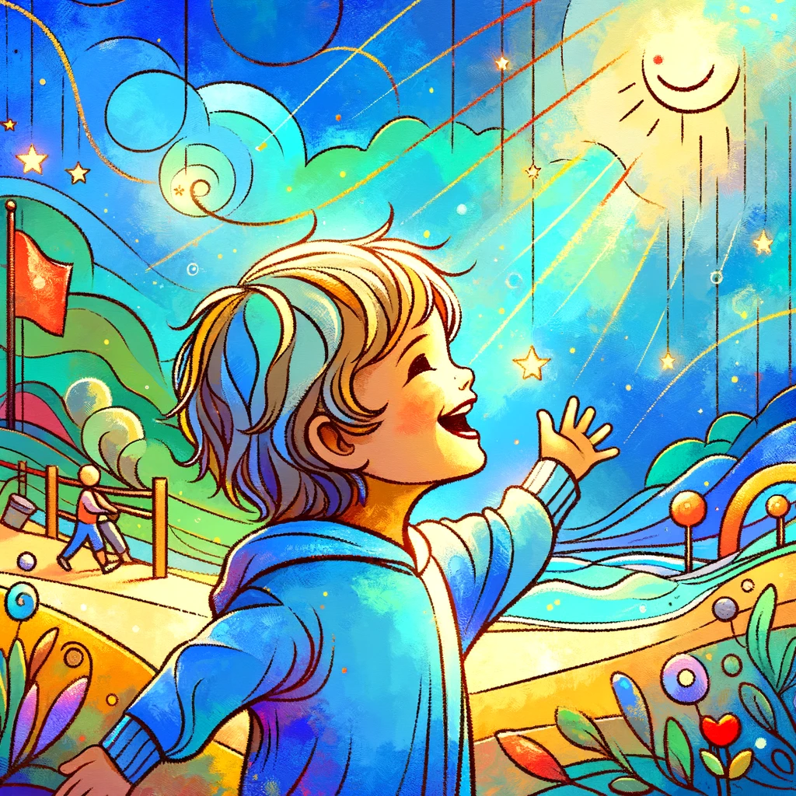
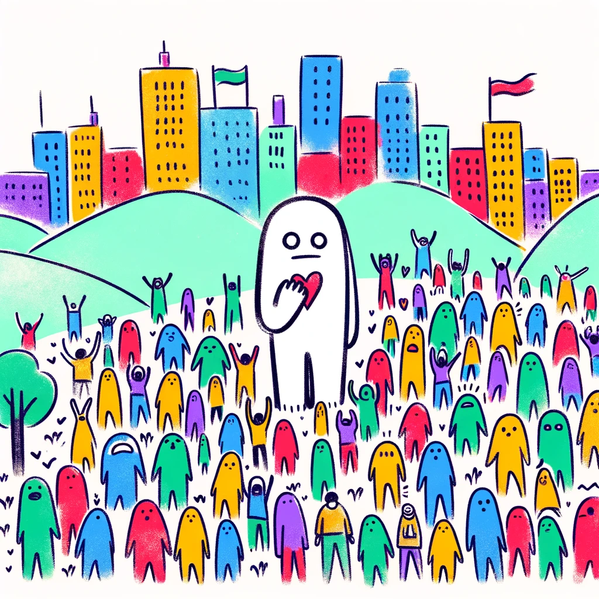

# LyricsNFT

Which song by Guns'N'Roses does this image show?

---

And which Taylor Swift's song does this image show?

---

If you are able to guess the lyrics that inspired an artist who created those images, 
you get an the image's NFT. Having this NFT grants you a free ticket for the next concert. 
(Or some other goodie, whatever the artist decides to do.)

## About the project
LyricsNFT was a learning project during the AwesomWasm hackathon. 
It is a CosmWasm contract that accepts from its owner (the artist's org team)
a hash of the lyrics and the info on where the image's url.

The contract creates an NFT connected with the provided image.

Fans can send messages to the contract (for a fee), guessing the lyrics that inspired the image.
The contract checks the guess by hashing the proposed lyrics and comparing it to the hash associated with the NFT.
The first fan to guess correctly receives the NFT.

## Limitatios
This is a basic, exploratory project, and it has significant limitations. 
The two most obvious are:

### Fans Brute Forcing the Solution

Any motivated fan can iterate over different lyrics and run the hash function locally, making sure that they would need only one guess to guess correctly. 

POTENTIAL SOLUTION: I am wondering if using the Secret Network would help here?

### Organizers Cheating on Fans

There is no guarantee that the hash supplied by the organizer actually does correspond to lyrics. 

POTENTIAL SOLUTION: This is not too big a problem because the artists would typically have their social capital at stake. 
I am wondering if we could potentially provide a ZK proof that the hash corresponds to some lyrics. 